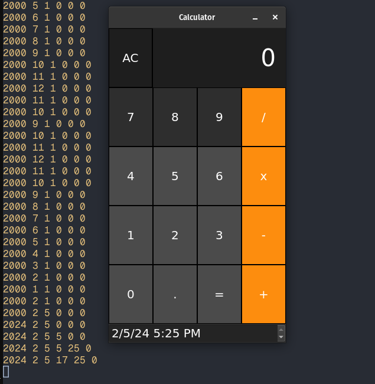

# solid-nodegui

A solidjs renderer for [NodeGui](https://nodegui.org/).

This is just a proof-of-concept with just some Qt widgets implemented and flex layout powered by facebook's [Yoga](https://github.com/facebook/yoga) layout engine (the same one used by `react-native`).

This shows just how simple it would be to create a `solid-native` renderer. That runs right on top of a native renderer like Qt.

---

Most nodegui renderers implement `react-native`-style components like `view`, `text`, and `button`. `solid-nodegui` stays close to Qt and nodegui and simply wraps existing widgets in solid components.

There is no event delegation and events are attached to the specific widget, `solid-nodegui` follows solid's style with `on:*` prop style. `QPushButton`'s click event is `clicked` so `solid-nodegui`'s is `on:clicked`.

Widgets and their solid wrappers are registered in the `WidgetRegistry`. `solid-nodegui` delegates widget-specific work to the registry making it easily extensible. See below.

## Set up

Run `npm install` to download and install the dependencies.

## Building

### Build `solid-nodegui`

```
cd packages/solid-nodegui && npm run build
```

### Build the calculator app

`npm run build` will build the code in `src` and produce a bundle file in `dist`.

```
cd packages/calculator && npm run build
```

### Running the calculator app

`npm run run` will run the bundled application. Note, you will have to build it first.

### Packaging the calculator app

`npm run package` will run [Jam Pack NodeGui](https://github.com/sedwards2009/jam-pack-nodegui) with a configuration file to create the relevant packages for the current operating system this is running on. The output appears in `tmp-jam-pack-nodegui/jam-pack-nodegui-work/`.

## Configured Scripts

- `build` - Runs all of the build steps.
- `run` - Runs the application from the `dist` folder.
- `package` - Build packages for the application. The output appears in `tmp-jam-pack-nodegui/jam-pack-nodegui-work/`

## Widget wrappers

```ts
import * as gui from "@nodegui/nodegui";
import {
  EventProps,
  WidgetEventProps,
  handleEvents,
  WidgetRegistry,
} from "solid-nodegui";

// make the wrapper
function QDateTimeEdit(
  props: {
    id?: string;
    dateTime: gui.QDateTime;
  } & EventProps<gui.QDateTimeEditSignals> &
    WidgetEventProps
) {
  let node: gui.QDateTimeEdit;
  // events are automatically handled
  const local = handleEvents(() => node, props);
  return <q-date-time-edit ref={node} {...local} />;
}

// register the widget
WidgetRegistry.registerWidget("q-date-time-edit", {
  widget: gui.QDateTimeEdit,
  setProperty(node, name, value, prev) {
    if (name === "dateTime") {
      node.setDateTime(value as gui.QDateTime);
      return true;
    }
  },
});

// render it
const dateTime = new gui.QDateTime();
<QDateTimeEdit
  dateTime={dateTime}
  on:dateTimeChanged={(qDateTime) => {
    console.log(
      qDateTime.date().year(),
      qDateTime.date().month(),
      qDateTime.date().day(),
      qDateTime.time().hour(),
      qDateTime.time().minute(),
      qDateTime.time().second()
    );
  }}
/>;
```

Final result here rendered under the calculator



---

Repository based on https://github.com/sedwards2009/nodegui-simple-starter
